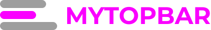

<div id="top"></div>

[![Contributors][contributors-shield]][contributors-url]
[![Forks][forks-shield]][forks-url]
[![Stargazers][stars-shield]][stars-url]
[![Issues][issues-shield]][issues-url]

<!-- PROJECT LOGO -->
<br />
<div align="center">
  <p align="center">
    <a href="https://github.com/renatosouzaBR/mytopbar" target="blank"></a>
  </p>

  <p align="center">
    Um TopBar <a href="https://pt-br.reactjs.org">ReactJS</a> completo e responsivo para usar em seus projetos
    <br />
    <br />
    <a href="https://github.com/renatosouzaBR/mytopbar/issues">Reportar um problema</a>
    ·
    <a href="https://github.com/renatosouzaBR/mytopbar/issues">Solicitar nova feature</a>
  </p>
</div>

<!-- ABOUT THE PROJECT -->

## Sobre o projeto

Na maioria das vezes, quando crio um projeto web, eu comeco a desenvolvedor a topbar (ou header) com menu, logo, etc, do zero, ou então eu faco a copia de um modelo pronto, porém nessa segunda opcão, mesmo sendo uma copia, demanda de modificacões, e isso acaba gerando um trabalho, além de que, caso eu queira mudar uma caracteristica em minha topbar, devo fazer a modificacão por projeto.

Motivacão:

- Foco na feature/objetivo principal do projeto.
- Não repetir a criacão de um novo topbar por projeto.
- Padronizacão de componente de topbar.

Óbvio que nenhum componente atenderá a todos os projetos, pois cada Design pensa e desenvolve um layout pensando na solucão como um todo. No caso de alguma modificacão ou nova caracteristica, você pode abrir uma issue ou se aventurar em implementar uma PR.

<p align="right">(<a href="#top">voltar ao topo</a>)</p>

### Desenvolvido com:

- [ReactJS](https://pt-br.reactjs.org)
- [Styled Component](https://styled-components.com/)
- [TypeScript](https://www.typescriptlang.org/)

<p align="right">(<a href="#top">voltar ao topo</a>)</p>

<!-- GETTING STARTED -->

## Começando

Siga as etapas para ter o componentes instalado e funcionando em seu projeto.

### Requisitos necessários

Instale as libs seguintes para que a utilização aconteça sem nenhum problema.

Com [NPM](https://www.npmjs.com/):

```sh
npm install styled-components --save-dev
```

Caso queira utilizar [Yarn](https://yarnpkg.com/):

```sh
yarn add -D styled-components
```

### Instalação

Vamos fazer a instalação do componente para vermos o qual rapido é instalar e começar a utilizar.

1. Abra seu terminal e execute o comando abaixo dentro da pasta do seu projeto

```sh
npm install mytopbar
```

Ou com Yarn:

```sh
yarn add mytopbar
```

<p align="right">(<a href="#top">voltar ao topo</a>)</p>

<!-- USAGE EXAMPLES -->

## Como utilizar

- Adicione o código de exemplo abaixo para começar a utilizar o componente.

```ts
import { MyTopbar } from "mytopbar"; //Aqui eu importo o componente

export const App = () => {
  return (
    <MyTopbar
      barOptions={{
        height: 60,
        maxWidth: 1366,
      }}
      logo={{ SvgFullLogo: FullLogo, SvgCompactLogo: CompactLogo }}
      menu={{
        bgColor: "#fff",
        textColor: "#8F00C1",
        textSize: "18px",
        closeButtonColor: "#00000080",
        hamburgerIconColor: "#8F00C1",
        borderColor: "#8F00C1",

        items: [
          {
            label: "Cadastros",
            submenu: [{ label: "Clientes" }, { label: "Produtos" }],
          },
          { label: "Financeiro" },
          { label: "Estoque" },
        ],
      }}
    />
  );
};
```

- Vamos explorar cada propriedade da configuração do componente:

| Propriedade |                    |                                                                                                                                                                              |
| ----------- | ------------------ | ---------------------------------------------------------------------------------------------------------------------------------------------------------------------------- |
| barOptions  | height             | Altura da barra principal                                                                                                                                                    |
|             | maxWidth           | Largura em que a barra principal deve se estender                                                                                                                            |
| logo        | SvgFullLogo        | Imagem da logo completa para telas > 960px                                                                                                                                   |
|             | SvgCompactLogo     | Imagem da logo compacta para telas < 960px                                                                                                                                   |
| menu        | items              | Itens do menu. Você deve adicionar uma label para o nome, eventos de click, submenus, etc.                                                                                   |
|             | bgColor            | Cor de fundo do menu. Quando a tela for < 960px, o menu se estende por toda a tela, caso contrario a cor so é aplicada a submenus, onde o menu deve ter o mesmo bg da barra. |
|             | textColor          | Cor do texto do menu                                                                                                                                                         |
|             | textSize           | Tamanho do texto do menu. Pode ser utilizado px, em, rem, etc.                                                                                                               |
|             | closeButtonColor   | Cor do botão de fechar menu. Apenas para telas < 960px                                                                                                                       |
|             | hamburgerIconColor | Cor do icone de menu hamburguer. Apenas para telas < 960px                                                                                                                   |
|             | borderColor        | Cor da borda do efeito hover do menu e submenu                                                                                                                               |

<p align="right">(<a href="#top">voltar ao topo</a>)</p>

<!-- ROADMAP -->

## Roteiro

- [x] Adicionar barra principal para compor os demais itens
- [x] Adicionar renderização de logo completa e compacta para responsividade
- [x] Adicionar menu/submenu com responsividade
- [ ] Adicionar menu com opções gerais (menu de avatar)
- [ ] Adicionar props children para cada componente (logo, menu, menu avatar) para ser possível substituir toda a implementação de cada parte da topbar.
- [ ] Adicionar gif de demonstração do componente
- [ ] Adicionar testes
- [ ] Publicar NPM
- [ ] Adicionar mais props para mudança de layout

Veja as [questões abertas](https://github.com/renatosouzaBR/mytopbar/issues) para uma lista completa de recursos propostos e problemas conhecidos.

<p align="right">(<a href="#top">voltar ao topo</a>)</p>

<!-- CONTRIBUTING -->

## Contribuição

As contribuições são o que torna a comunidade de código aberto um lugar incrível para aprender, inspirar e criar.

Se você tiver uma sugestão que torne isso melhor, faça um fork do repositório e crie um PR. Você também pode simplesmente abrir uma [issue](https://github.com/renatosouzaBR/mytopbar/issues) com a tag "feature". Não se esqueça de dar uma estrela ao projeto!

1. Faça um fork do projeto
2. Crie sua branch de feature (`git checkout -b feature/suafeature`)
3. Faça commit de suas alterações (`git commit -m 'O que o commit faz?'`)
4. Envie para a branch (`git push origin feature/suafeature`)
5. Abra um PR

<p align="right">(<a href="#top">voltar ao topo</a>)</p>

<!-- LICENSE -->

## Licença

MIT License

Copyright (c) 2021

Permission is hereby granted, free of charge, to any person obtaining a copy
of this software and associated documentation files (the "Software"), to deal
in the Software without restriction, including without limitation the rights
to use, copy, modify, merge, publish, distribute, sublicense, and/or sell
copies of the Software, and to permit persons to whom the Software is
furnished to do so, subject to the following conditions:

The above copyright notice and this permission notice shall be included in all
copies or substantial portions of the Software.

THE SOFTWARE IS PROVIDED "AS IS", WITHOUT WARRANTY OF ANY KIND, EXPRESS OR
IMPLIED, INCLUDING BUT NOT LIMITED TO THE WARRANTIES OF MERCHANTABILITY,
FITNESS FOR A PARTICULAR PURPOSE AND NONINFRINGEMENT. IN NO EVENT SHALL THE
AUTHORS OR COPYRIGHT HOLDERS BE LIABLE FOR ANY CLAIM, DAMAGES OR OTHER
LIABILITY, WHETHER IN AN ACTION OF CONTRACT, TORT OR OTHERWISE, ARISING FROM,
OUT OF OR IN CONNECTION WITH THE SOFTWARE OR THE USE OR OTHER DEALINGS IN THE
SOFTWARE.

<p align="right">(<a href="#top">voltar ao topo</a>)</p>

<!-- CONTACT -->

## Contatos

Renato Souza - [Linkedin](www.linkedin.com/in/renato-alves-de-souza-33422772) - natoicm@gmail.com

GitHub: [https://github.com/renatosouzaBR](https://github.com/renatosouzaBR)

<p align="right">(<a href="#top">voltar ao topo</a>)</p>

<!-- ACKNOWLEDGMENTS -->

<!-- MARKDOWN LINKS & IMAGES -->
<!-- https://www.markdownguide.org/basic-syntax/#reference-style-links -->

[contributors-shield]: https://img.shields.io/github/contributors/renatosouzaBR/mytopbar.svg?style=for-the-badge
[contributors-url]: https://github.com/renatosouzaBR/mytopbar/graphs/contributors
[forks-shield]: https://img.shields.io/github/forks/renatosouzaBR/mytopbar.svg?style=for-the-badge
[forks-url]: https://github.com/renatosouzaBR/mytopbar/network/members
[stars-shield]: https://img.shields.io/github/stars/renatosouzaBR/mytopbar.svg?style=for-the-badge
[stars-url]: https://github.com/renatosouzaBR/mytopbar/stargazers
[issues-shield]: https://img.shields.io/github/issues/renatosouzaBR/mytopbar.svg?style=for-the-badge
[issues-url]: https://github.com/renatosouzaBR/mytopbar/issues
